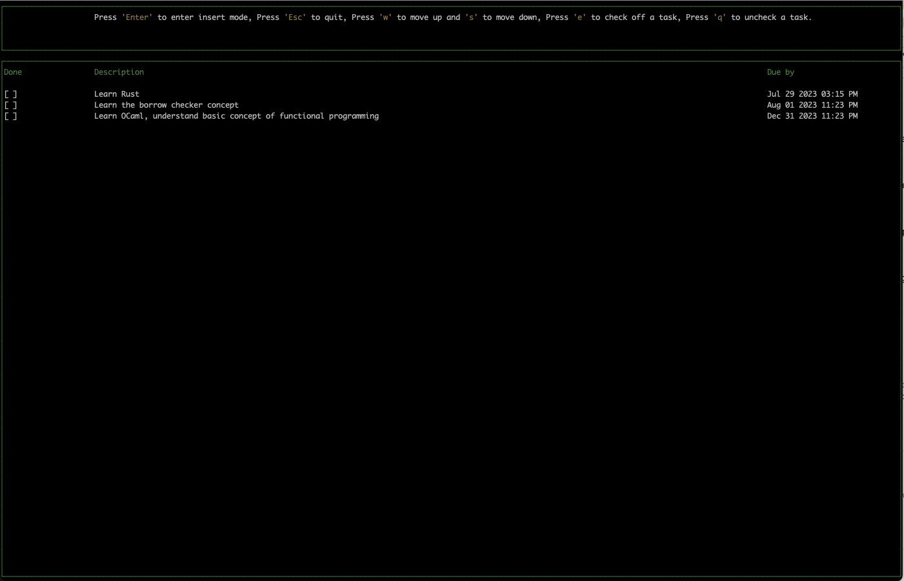
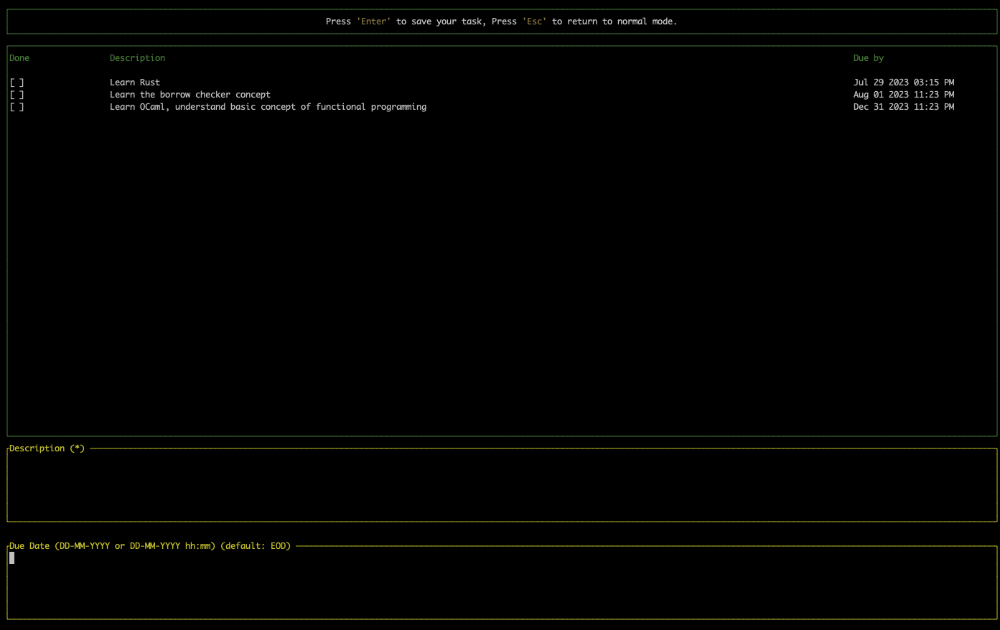

# TUI DO List

## Description

This is a simple todo list application written in Rust. It uses the [Ratatui.rs](https://github.com/ratatui-org/ratatui) library to provide a terminal user interface.

## Overview

This project is a simple todo list application written in Rust.

#### Jul 20th, 2023

- Add basic terminal interface

#### Jul 22nd, 2023

- Finish basic terminal interface
- Add user input
- Changed lib to Ratatui
- Next: add database

#### Jul 25th 2023

- Added database
- Add task CRUD

#### Jul 26th 2023

- Add task CRUD
- Mark task as done

#### Jul 27th 2023

- Adjusting "FE" style

#### Jul 28th 2023

- Adding due date

#### Jul 29th 2023

- Added due date to the Task table
- Next: Grouping by date

#### Aug 8th 2023

- Added due date to the Task table
- This project is now finished, I will not add any more features because I feel like I'm spending more time defining layouts and designs than actually learning Rust.
